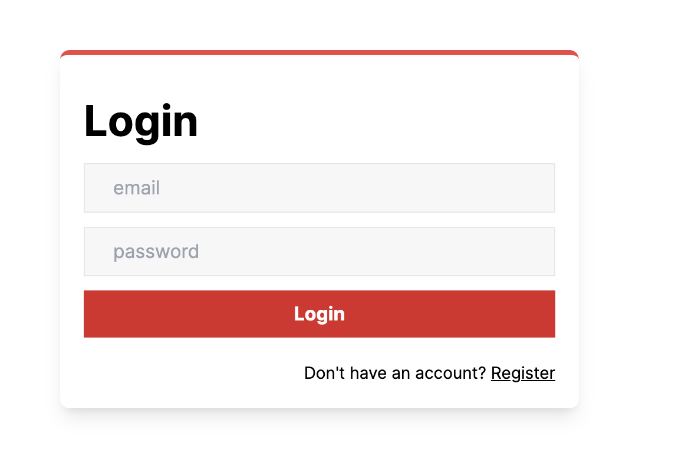
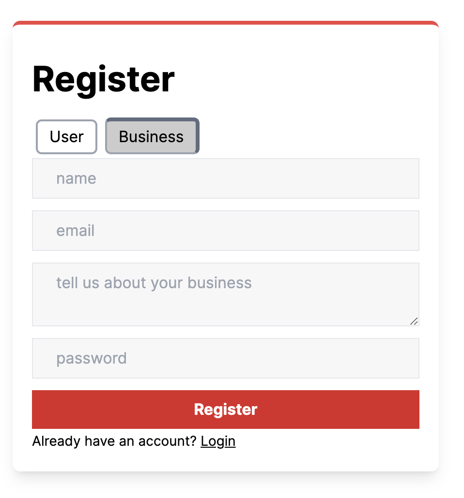
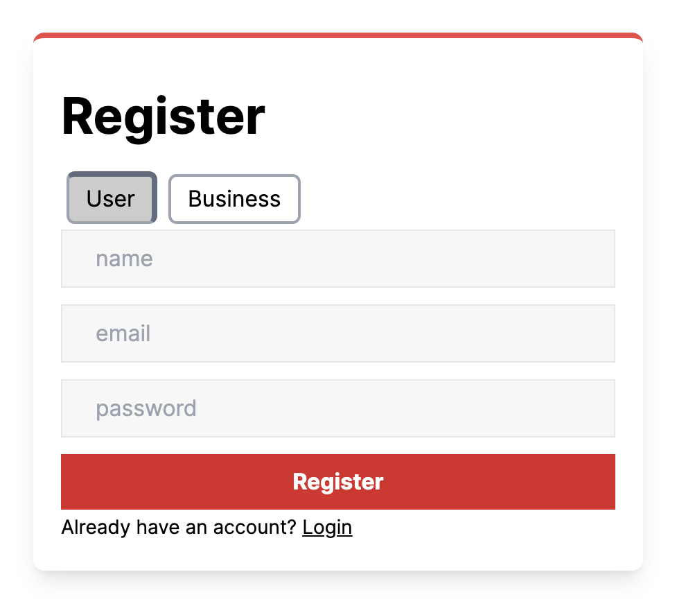
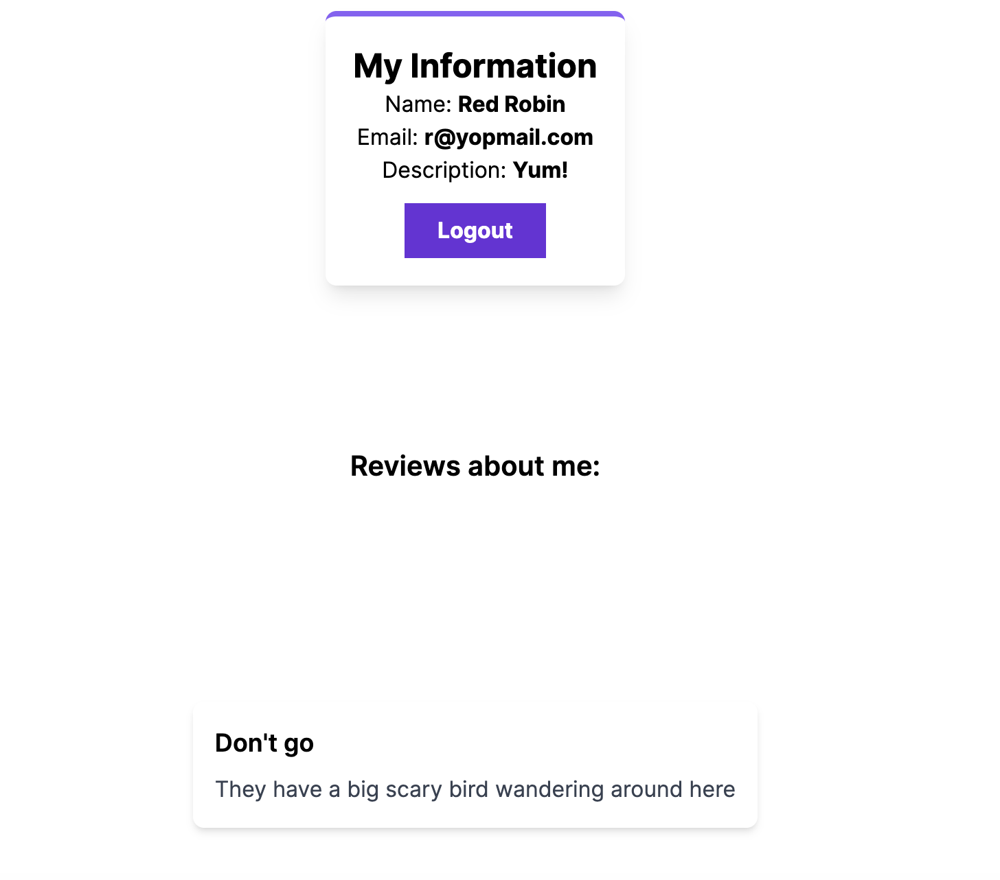
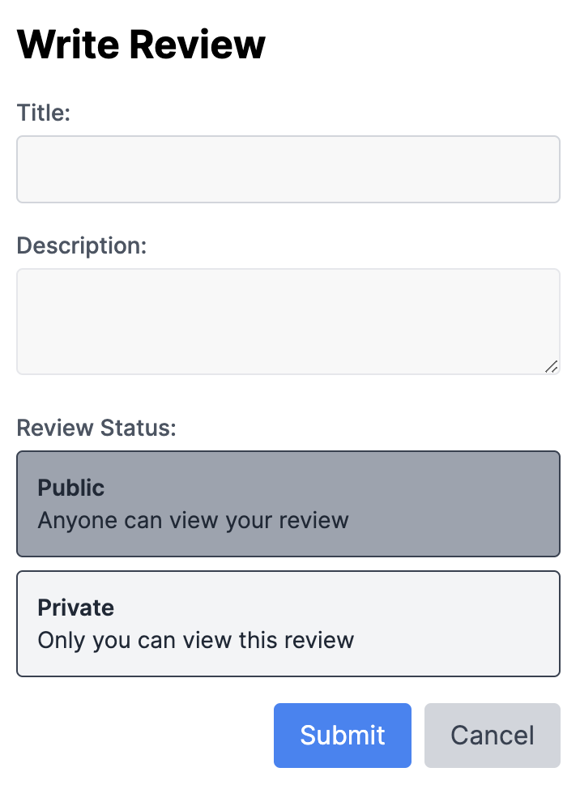
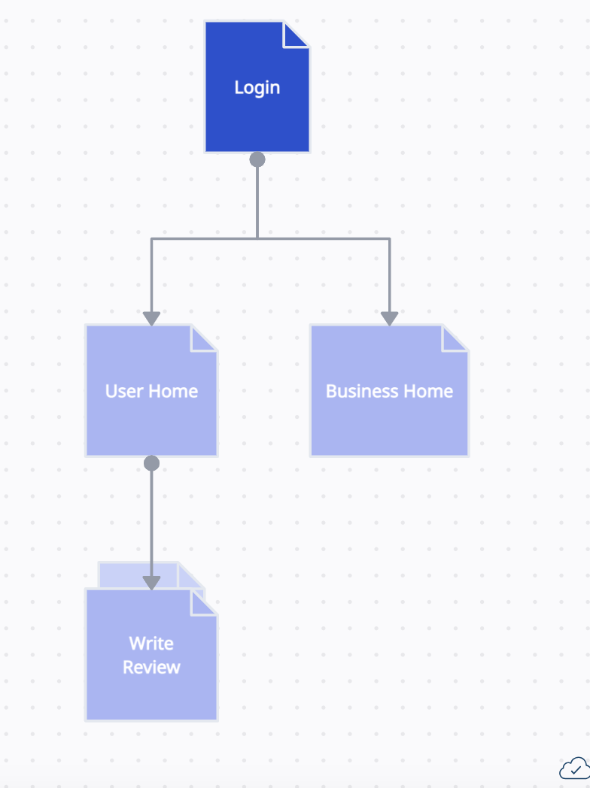

# Places 

## Overview
This is business review website where businesses can register and write a short description about themselves. Users can browse these businesses and view information that they have wrote about themseslves. Users can also see all the reviews they have written. They can make reviews public in which case businesses can also view the reviews. Or they can make them private so that only they can see them. 

## Data Model

The application will store Users, Reviews and Businesses

* users can have multiple reviews they will be stored by the review id
* businesses can have multiple reviews they will be stored by the review id
* reviews will store the user id of whoever wrote it
* reviews will store the business id of who it is about


An Example User:

```javascript
{
    userID: 123456, // unique identifier
    username: Squilliam,
    email: 'squill@hotmail.com',
    passwordHash: // a password hash,
    reviews: // array of reviewID's they've written 
}
```
An Example Business:

```javascript
{
    name: "Big Paul's House of Munch",
    description: 'Enjoy burgers, milkshakes, and fries here!',
    email: 'bigPaul@bigPaul.com',
    passwordHash: // password hash,
    reviews:  // array of the reviews that have been written about them
}
```
An Example Review:

```javascript
{
    userID: 1223456, // to identify who wrote the review
    businessID: 98765432, // to identify the business being described
    title: "My favorite"
    text: "I loved big Paul's house of Munch! Go there! The salad... The service", // th actual review
    privacy: 'public' || 'private' // to see who else can see this review
}
```

## [Link to Schema](models/user.ts) 


## Wireframes


/login - page for logging in or directing new users



/register - page for registering new user





/business-home - page for viewing reviews about your business



/user-home - page for browsing businesses and writing reviews


/review-form - a modal for creating reviews




## Site map



## User Stories
1. as non-registered user, I can register a new account with the site
2. as non-registered business, I can register a new account with the site
3. as a user, I can log in to the site
4. as a business, I can log in to the site
5. as a user, I can browse registered businesses
6. as a user, I can browse all the reviews I have written
7. as a business, I can browse public reviews that have been written about me


## Research Topics

* (6 points) Nextjs
    * Used in pages to create components
    * Used for routing
* (1 point) Tailwind CSS
    * Used in all components to create better look
* (1 point) Bcrypt
    * Used to hash passwords
* (1 point) Typescript
    * Used typescript to help verify types
* (1 point) Deployed on Vercel
    * Deployed on Vercel in order to keep domain after semester
